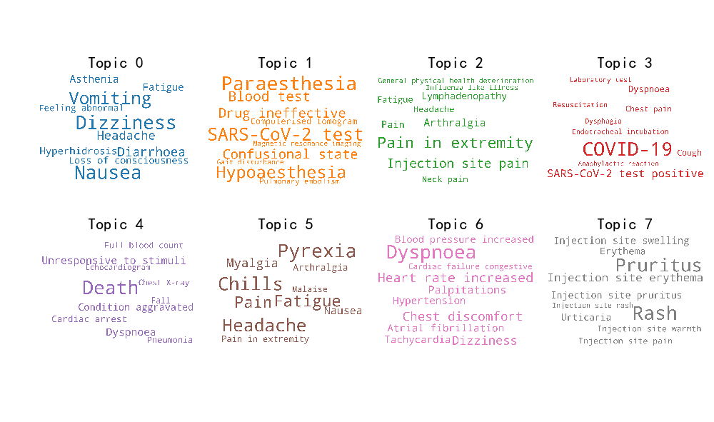

# Covid-19 Vaccine Adverse Event Detection

This project provides our on-going researh on vaccine adverse event detection using topic modeling and multi-label classification methods, taking the Covid-19 vaccine adverse event reporting dataset as an example. 

## Datasets

The dataset in this study is from Kaggle's Covid-19 World Vaccine Adverse Reaction [Dataset](https://www.kaggle.com/ayushggarg/covid19-vaccine-adverse-reactions). Orignal sources are from the U.S's CDC website (Please see [here](https://vaers.hhs.gov/data.html)). 

## Methods

### 1. Topic Modeling

Here we apply topic modeling methods in obtaining topic distribution of VAERS reports. With the use of topic coherence measures, we choose the optimal topic models as output labels for modeling adverse event detection into multi-label problems. 

### 2. Multi-label Classification

Based on topic-based labels obtained above, various types of multi-label classification methods has been applied and improved towards vaccine adverse event detection. The methods mainly includes four types, namely, problem transformatoin, one-vs-rest, algorithm adaption and deep learning methods. Each type may contain a series of techniques to handle complexity of classifying VAERS reports. 

## Results

Part of our research results can be found as follows. 

### 1. WordCloud of Covid-19 related terms

Figure 1. Word Cloud using the LDA model with the eight-topic setting

### 2. Topic distributoin visualization with different numbers of topics

More topic visualization can be found in the following list.

The model with K=5 is [here](visualize/pyLDAvis_5.html).

The model with K=6 is [here](visualize/pyLDAvis_6.html).

The model with K=7 is [here](visualize/pyLDAvis_7.html).

The model with K=8 is [here](visualize/pyLDAvis_8.html). (Best model as we found)

The model with K=9 is [here](visualize/pyLDAvis_9.html).

The model with K=10 is [here](visualize/pyLDAvis_10.html).

The model with K=11 is [here](visualize/pyLDAvis_11.html).

The model with K=12 is [here](visualize/pyLDAvis_12.html).

The model with K=13 is [here](visualize/pyLDAvis_13.html).

The model with K=14 is [here](visualize/pyLDAvis_14.html).

The model with K=15 is [here](visualize/pyLDAvis_15.html).

More are comming. 